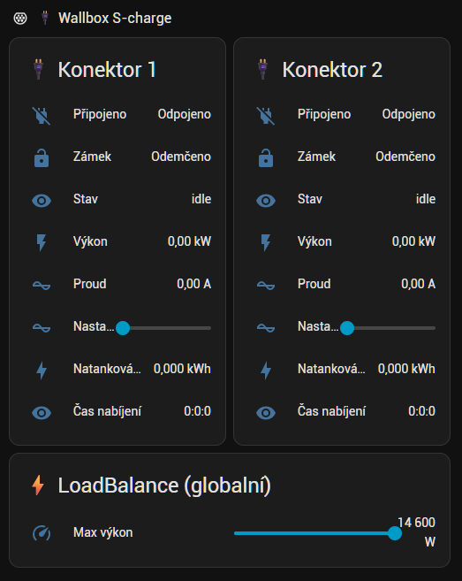

# SCharge — Home Assistant integration pro Wallbox S-charge

Home Assistant custom component pro wallboxy **Schlieger S-charge** /
**Joint Tech JNT-EVCD2** (a podobné OEM rebrandy). Umožňuje plné monitorování
a ovládání přes lokální WebSocket protokol (`ocpp1.6` subprotocol).

**Autor:** Pavel Třešňák (kompletní reverse engineering + implementace ve spolupráci
s Claude.AI — viz [projekt WallBox](https://github.com/paveltresnak/SCharge/tree/main/WallBox) pro reverse engineering dokumentaci).



## Protokol

Wallbox běží jako **WebSocket klient** — sám se připojí na discovery broadcast
z HA strany. Není potřeba žádný cloud, BLE ani externí hardware.

```
┌─────────────────────────────────────┐
│  Home Assistant                     │
│    custom_components/scharge/       │
│     ├── WS server (port 41515)      │
│     └── UDP broadcast (port 3050)   │
└──────────┬──────────────────────────┘
           │
           │  1. UDP broadcast "UDPHandShake" (source port 3050)
           │  2. Wallbox connects back via WebSocket (ocpp1.6)
           │  3. Wallbox sends telemetry (Heartbeat, DeviceData,
           │     SynchroStatus, SynchroData, NWireToDics)
           │  4. HA ACKs + sends LoadBalance / Lock / PnC commands
           ▼
┌─────────────────────────────────────┐
│  Wallbox (192.168.1.x)              │
│  S/N: 2100XXXXXXXXXXXXX             │
└─────────────────────────────────────┘
```

## Instalace

### Manuální

1. Zkopírujte složku `custom_components/scharge/` do `/config/custom_components/`
   na Vašem Home Assistant (na Synology typicky:
   `/volume1/docker/homeassistant/config/custom_components/`)
2. **Restart Home Assistant**
3. **Settings → Devices & Services → + Add Integration → S-charge Wallbox**
4. Zadejte sériové číslo wallboxu (`chargeBoxSN` — najdete na typovém štítku, formát `2100…`)

### HACS (po publikaci)

1. HACS → Integrations → 3-tečky → Custom repositories
2. Add `https://github.com/paveltresnak/SCharge` jako Integration
3. Download → Restart HA → Add Integration

## Požadavky

- Home Assistant Container / OS / Supervised (network_mode: host — výchozí)
- Python `websockets>=12.0` (automaticky nainstaluje HA)
- Wallbox + HA na stejné L2 broadcast doméně (UDP discovery)

## Poskytované entity

### Sensors (per konektor 1 + 2)

Wallbox má 2 zásuvky (konektory). V wire protokolu (JSON) jsou označené
`connectorMain` / `connectorVice`, ve UI (entity IDs, display názvy) používáme
čísla `1` / `2` podle pořadí fyzických zásuvek na zařízení.

> **⚠️ Poznámka k entity_id:** prefix `wallbox_s_charge_` v příkladech níže je
> slugifikovaný **název zařízení** zvolený při konfiguraci — u tebe může být jiný
> (např. `s_charge_`). Část za prefixem (`connector_1_voltage`, `load_balance`, …)
> je dána integrací. Slug může být **lokalizovaný** podle jazyka HA (CS/EN) — vždy
> si ověř skutečné entity_id v *Developer Tools → States*.

| Entity | Jednotka | Popis |
|---|---|---|
| `sensor.wallbox_s_charge_connector_1_voltage` | V | Napětí konektor 1 |
| `sensor.wallbox_s_charge_connector_1_current` | A | Proud konektor 1 |
| `sensor.wallbox_s_charge_connector_1_power` | **kW** | Okamžitý výkon konektor 1 |
| `sensor.wallbox_s_charge_connector_1_energy_session` | kWh | Energie aktuální session |
| `sensor.wallbox_s_charge_connector_1_charging_time` | text | Čas nabíjení (H:M:S) |
| `sensor.wallbox_s_charge_connector_1_status` | text | `idle` / `wait` / `charging` / `finish` — viz slovník níže |

Pro **konektor 2** to samé (`sensor.wallbox_s_charge_connector_2_voltage`, ...).

#### Slovník `..._status` (chargeStatus)

Výrobce ho nikde nedokumentuje — tohle je poskládané z pozorování na FW
`E3P3_H_1.1.1_R5190`. Může být neúplný.

| Stav | Význam |
|---|---|
| `idle` | kabel odpojený, nic neběží |
| `wait` | **přechodně** po `Authorize Start`, než auto začne brát proud |
| `charging` | reálně nabíjí |
| `finish` | **session skončila, ale kabel zůstal v zásuvce** — typicky když auto dosáhne svého limitu SoC |

> **⚠️ Ze stavu `finish` wallbox odmítá i `Authorize Start`** — nabíjení už z HA
> znovu rozjet nejde, ani po zvýšení limitu SoC v autě. Pomůže odpojit a znovu
> zapojit kabel. Spolehlivá cesta ven z `finish` **není ověřená**; pokud na
> nějakou přijdeš, ozvi se do issues.
>
> `finish` je i důvod, proč integrace hlásí stav nabíjení **whitelistem**
> (`on` jen pro `charging`). Do v0.6.0 se používal blacklist `!= 'idle'`, který
> `finish` hlásil jako „nabíjím" — uživatel dal Stop a wallbox ho odmítl, protože
> žádná session neběžela.

> **Poznámka k jednotkám výkonu:** `suggested_unit_of_measurement` platí **jen při
> vytvoření entity**. Oprava jednotky z v0.5.4 (W → kW) proto zabrala jen novým
> instalacím — kdo integraci provozoval dřív, může mít v registry zamrzlé `W`.
> Pozná se to tak, že `states()` vrací hodnoty ve wattech. Řešení: v *Nastavení →
> Entity → [entita] → Jednotka* přepnout ručně na kW.

### Binary sensors

| Entity | Popis |
|---|---|
| `binary_sensor.wallbox_s_charge_connector_1_connected` | Auto je připojené (konektor 1) |
| `binary_sensor.wallbox_s_charge_connector_1_lock` | Elektronický zámek konektoru 1 |
| `binary_sensor.wallbox_s_charge_connector_1_pnc` | Plug-and-Charge stav (konektor 1) |
| `binary_sensor.wallbox_s_charge_connector_2_connected` | Auto je připojené (konektor 2) |
| `binary_sensor.wallbox_s_charge_connector_2_lock` | Elektronický zámek konektoru 2 |
| `binary_sensor.wallbox_s_charge_connector_2_pnc` | Plug-and-Charge stav (konektor 2) |
| `binary_sensor...n_wire_exists` | N-Wire detekován (diagnostika) — **vypnuté by default**, viz níže |
| `binary_sensor...n_wire_closed` | N-Wire relé sepnuto (diagnostika) — **vypnuté by default**, viz níže |

> **N-Wire entity jsou ve výchozím stavu zakázané** (`disabled_by: integration`) — jsou to
> diagnostické entity, ve *States* je neuvidíš, dokud je nepovolíš v *Nastavení → Zařízení
> a služby → S-charge Wallbox → entity*. Jejich entity_id navíc obsahuje **sériové číslo**
> wallboxu (např. `binary_sensor.wallbox_s_charge_2100…_n_wire_exists`).

### Globální sensors

| Entity | Jednotka | Popis |
|---|---|---|
| `sensor.wallbox_s_charge_load_balance` | W | Aktuální max výkon (LoadBalance) |
| `sensor.wallbox_s_charge_lifetime_energy` | kWh | Kumulativní energie |
| `sensor.wallbox_s_charge_charging_sessions` | count | Počet session |
| `sensor.wallbox_s_charge_meter_voltage` | V | Napětí externího MID metru (pokud je) |
| `sensor.wallbox_s_charge_meter_current` | A | Proud externího MID metru |
| `sensor.wallbox_s_charge_meter_power` | **kW** | Výkon externího MID metru (viz poznámka o jednotkách níže) |
| `sensor.wallbox_s_charge_wifi_rssi` | dBm | WiFi signál wallboxu |
| `sensor.wallbox_s_charge_firmware_version` | text | Firmware verze |
| `sensor.wallbox_s_charge_evse_type` | text | Model / typ wallboxu |

### Number (ovládání)

> ## ⚠️ Posunutí slideru „nabíjecí proud" SPUSTÍ NABÍJENÍ
>
> Není to bug, ale plyne to z protokolu a snadno tím člověk nechtěně nastartuje auto.
> Nastavení proudu se posílá jako **`Authorize` s `purpose="Start"`** — a ten příkaz
> **zakládá session**, nejen mění proud. Wallbox jinou páku na proud nenabízí
> (`LoadBalance` je jen building-level strop, který si navíc sám resetuje zpět).
>
> **Důsledky:**
> - Máš-li slider na kartě, i letmé zavadění o něj rozjede nabíjení.
> - S vypnutým PnC je to naopak *žádoucí* — je to jediná cesta, jak nabíjení
>   spustit z HA (spolu se switchem *Nabíjení konektor X*, který posílá totéž).
> - **V automatizaci vždy nejdřív ověř, že auto reálně nabíjí** (`power > 1 kW`),
>   a teprve pak proud nastavuj — jinak ti regulační smyčka nabíjení sama zapne
>   ve chvíli, kdy jsi ho vypnul. Vzor níže tuhle podmínku má a **není dekorativní**.
>
> Zjištěno 2026-07-16 uživatelem integrace: *„nechtiac som zavadil o posuvnik prudu,
> cim sa nabijanie aktivovalo"*.

> **⚠️ Tyhle entity mají entity_id závislé na jazyku HA.** Na rozdíl od sensorů a buttonů
> (které mají napevno anglický `name`) je `number` pojmenovaný jen přes `translation_key`,
> takže se slug tvoří z **lokalizovaného** názvu. **Ověř si skutečné entity_id**
> v *Developer Tools → States* (filtr `nabijeci` / `charging`).

| Entity (EN HA) | Entity (CS HA) | Rozsah | Popis |
|---|---|---|---|
| `number.wallbox_s_charge_connector_1_charging_current` | `number.wallbox_s_charge_konektor_1_nabijeci_proud` | 6–32 A | **Nabíjecí proud konektoru 1** — reálný per-session throttle (Authorize + nový proud). Toto je doporučená cesta PV modulace. |
| `number.wallbox_s_charge_connector_2_charging_current` | `number.wallbox_s_charge_konektor_2_nabijeci_proud` | 6–32 A | Nabíjecí proud konektoru 2 |
| `number.wallbox_s_charge_load_balance` | *(stejné)* | 4000–14600 W | Globální strop výkonu (LoadBalance). Hrubší než proud, ovlivňuje oba konektory dohromady. |

> **Pozor na `unknown`:** dokud na konektoru neběží session (typicky odpojené auto), wallbox
> hlásí `reserveCurrent = 0`. To není platný proud (rozsah je 6–32 A), takže entita od
> **v0.6.0** vrací `unknown` místo nuly. Dřív hlásila 0 a slider ukazoval jako minimum 0.

> **Proud (A) vs LoadBalance (W):** pro modulaci dle PV přebytku používej
> **per-konektor nabíjecí proud (A)** — moduluje konkrétní probíhající session
> jemně po 1 A. `load_balance` (W) je hrubý společný strop, který si wallbox stejně
> sám resetuje zpět na 14600. Reálné nasazení (regulační smyčka) jede přes ampéry.

### Buttons (ovládání)

| Entity | Akce |
|---|---|
| `button.wallbox_s_charge_connector_1_lock` | Zamknout konektor 1 |
| `button.wallbox_s_charge_connector_1_unlock` | Odemknout konektor 1 |
| `button.wallbox_s_charge_connector_1_pnc_open` | Plug-and-Charge OPEN — konektor 1 (bez auth) |
| `button.wallbox_s_charge_connector_1_pnc_close` | Plug-and-Charge CLOSE — konektor 1 (auth required) |
| `button.wallbox_s_charge_connector_2_lock` | Zamknout konektor 2 |
| `button.wallbox_s_charge_connector_2_unlock` | Odemknout konektor 2 |
| `button.wallbox_s_charge_connector_2_pnc_open` | Plug-and-Charge OPEN — konektor 2 |
| `button.wallbox_s_charge_connector_2_pnc_close` | Plug-and-Charge CLOSE — konektor 2 |

### Switch

| Entity | Stavy | Popis |
|---|---|---|
| `switch.wallbox_s_charge_bridge` (CS: „Můstek HA", EN: „Bridge") | `on` *(default)* / `off` | Vypni, když se chceš připojit na wallbox přes mobilní aplikaci S-charge. |
| `switch...zamek_konektor_{1,2}` (CS) / `switch...connector_{1,2}_lock` (EN) | `on` = **zamčeno** | Elektronická západka konektoru. Nahrazuje dvojici tlačítek *Lock* / *Unlock* jedním přepínačem. |
| `switch...plug_and_charge_konektor_{1,2}` (CS) / `..._plug_and_charge` (EN) | `on` = **bez autorizace** | Plug-and-Charge. `on` = po zapojení se nabíjení rozjede samo; `off` = nabíjej jen na povel z HA. Nahrazuje *PnC open* / *PnC close*. |
| `switch...nabijeni_konektor_{1,2}` (CS) / `switch...connector_{1,2}_charging` (EN) | `on` / `off` | Start/stop nabíjení na konektoru. **⚠️ Neověřeno na reálném voze — viz níže.** entity_id je lokalizované (jako u `number`) — ověř ve *States*. |

#### Můstek HA

**Pozadí:** Wallbox Joint Tech JNT-EVCD2 drží pouze **jednu aktivní WebSocket session**. Jakmile je HA integrace připojena, mobilní aplikace se k wallboxu nepřipojí. Bridge switch umožňuje HA na chvíli „krok stranou".

**Jak funguje:**
- **`off`** → HA zastaví UDP broadcast, zavře aktivní WS a **zastaví WS server (uvolní port)**. Wallbox se uvolní, mobilní app chytí session. Entity integrace přejdou na `unavailable`.
- **`on`** → HA nastartuje WS server zpět a obnoví UDP broadcast; wallbox se typicky vrátí **do ~20 s**. Entity se obnoví.

> **Proč se port uvolňuje (od v0.6.0):** wallbox si pamatuje poslední endpoint a připojuje se tam bez ohledu na to, kdo broadcastuje. Když WS server dál poslouchal, HA jeho spojení přijímal a neobsluhoval → hromadily se desítky spojení ve `FIN_WAIT1` a link byl mrtvý, dokud nevypršely TCP timeouty (~3 min). Do v0.5.4 to postihovalo i samotný toggle `off`→`on`.

Switch najdeš v **Settings → Devices & Services → S-charge Wallbox → Configuration entities** (kategorie CONFIG).

#### Zámek a Plug-and-Charge (od v0.7.0)

Jedna entita místo dvojice tlačítek — ukazuje stav i ovládá. **Tlačítka
`button...lock` / `_unlock` / `_pnc_open` / `_pnc_close` zůstávají** a nejsou
deprecated; kdo na nich má postavené šablony, nemusí měnit nic.

> **⚠️ `switch...zamek` je oproti `binary_sensor..._lock` schválně obrácený.**
> Binary sensor má `device_class: lock`, kde HA konvence je `on` = **odemčeno**
> (device classy mají „problem semantic" — `on` = abnormální stav). U switche
> uživatel čeká `on` = zamčeno. Obě entity tedy ukazují opačnou hodnotu a obě
> mají pravdu. Nesnaž se je „sjednotit".

> **PnC:** wire protokol používá `open` (bez autorizace) / `close` (autorizace
> nutná). Switch to překládá: `on` = open. **`off` je scénář „nabíjej jen na
> povel z HA"** — auto se po zapojení samo nerozjede a nabíjení spustíš
> switchem *Nabíjení konektor X*.

#### Nabíjení konektor 1/2

Start/stop přes `Authorize Start` / `Authorize Stop`. **Ověřeno na reálném voze**
(2026-07-16, firmware `E3P3_H_1.1.1_R5190`) — Start i Stop fungují opakovaně,
i s **vypnutým PnC** (scénář „nabíjej jen na povel z HA").

> **⚠️ `Authorize Start` zakládá session, nejen škrtí proud.** S vypnutým PnC je to
> jediná cesta, jak nabíjení rozjet z HA. **Důsledek: i pohyb sliderem „nabíjecí
> proud" nabíjení spustí** — na to pozor, když si slider dáváš na kartu.
> Regulační automatizace to nepotká, pokud má skip při `power < 1 kW` (viz vzor níže).

**Wallbox příkaz přijme jen ve stavu, kdy dává smysl** — Stop když session běží,
Start když ji lze založit. Jinak ACKne `result: false` a **nic neudělá**: typicky
když auto není zapojené, nebo session sama skončila (auto dosáhlo svého limitu SoC).

**Pojistka:** switch se nikdy nepřepíná optimisticky — přepne se až po `result: true`,
jinak vyhodí chybu (s aktuálním `chargeStatus`) a stav nechá být. Stav `on` se hlásí
**výhradně** pro `chargeStatus == 'charging'`; cokoli jiného je `off`. Do v0.6.0 to
byl blacklist `!= 'idle'`, který mezistavy (kabel zapojený, session ukončená autem)
hlásil jako nabíjení — a Stop pak selhával.

## Automatizace — PV-driven modulace (přes ampéry)

Reálná modulace nabíjení dle solárního přebytku jede přes **nabíjecí proud
konektoru** (A), ne přes globální LoadBalance (W). Doporučený vzor je
**delta regulace** (feedback): každých ~15–30 s uprav proud o malý krok podle
toho, kolik přebytku/importu vidíš na bodě připojení, místo skokového
přepočtu — tím se vyhneš oscilacím.

Senzory `sensor.your_pv_surplus_w` apod. níže jsou **placeholdery** — dosaď
vlastní (výkon FVE, spotřeba domu, výkon na bodě připojení / grid).

```yaml
# Jednoduchý feedback: drž grid ≈ 0 (auto jí přebytek). 720 = 3φ·400V·√3 (W na A).
- alias: "Wallbox - PV modulace (ampéry)"
  mode: single
  trigger:
    - platform: time_pattern
      seconds: /15
  condition:
    # jen když auto reálně nabíjí na konektoru 1
    - condition: numeric_state
      entity_id: sensor.wallbox_s_charge_connector_1_power
      above: 1.0
  action:
    - variables:
        # kladné = export do sítě (přebytek), záporné = import. Dosaď svůj senzor.
        grid_export_w: "{{ states('sensor.your_grid_power_w') | float(0) }}"
        actual_a: "{{ states('sensor.wallbox_s_charge_connector_1_current') | float(0) }}"
        # krok úměrný přebytku, cap ±5 A/iter
        delta_a: "{{ [[ (grid_export_w / 720) | round(0) | int, 5] | min, -5] | max }}"
        target_a: "{{ [[ (actual_a + delta_a) | int, 6] | max, 32] | min }}"
    - service: number.set_value
      target:
        # ⚠️ entity_id je LOKALIZOVANÉ podle jazyka HA — ověř v Developer Tools → States.
        # EN HA: number.wallbox_s_charge_connector_1_charging_current
        # CS HA: number.wallbox_s_charge_konektor_1_nabijeci_proud
        entity_id: number.wallbox_s_charge_connector_1_charging_current
      data:
        value: "{{ target_a }}"
```

> **Tip:** v produkci přidej další podmínky (limit hlavního jističe, ochrana
> baterie při nízkém SOC, strop výstupu střídače) — nejpřísnější krok vítězí.
> Viz princip „nejnižší delta vyhrává" u feedback regulátoru.

## Changelog

Kompletní historie změn: viz [CHANGELOG.md](CHANGELOG.md).

## Licence

MIT — viz `LICENSE`.

## Poděkování

- `matemat13/ha_s-charge` — prvotní protokolová analýza (WebSocket/JSON discovery),
  která byla klíčovým vodítkem pro kompletní reverse engineering
- Claude.AI — spolupráce na návrhu a implementaci
